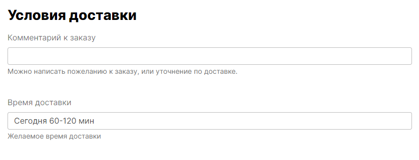

<p align="center">

</p>

## Form Builder 
Кароч изи пакет для инпутов. На основе ботсрапа.
  

 

## Установка
1) Установить из композера 
```  
composer require slavawins/formbuilder
```

2) Опубликовать js файлы необходимые для работы пакета.
Вызывать команду:
   ```
   php artisan vendor:publish --provider="SlavaWins\Formbuilder\Providers\FormbuilderServiceProvider"
   ``` 
После этого в папке public_html/js/ будут созданы 3 джс файла нужные для использования пакета

3) Подключить js файлы в любом удобном месте. Можно просто в app.blade.php
 ```
    <script src="{{ asset('js/formbuilder/formBuilderHelper.js') }}"></script>
    <script src="{{ asset('js/formbuilder/InputValidatorValues.js') }}"></script>
    <script src="{{ asset('js/formbuilder/InputValidatorValues.js') }}"></script>
 ```

## Использваоние

Открываете вью в котором хотите создать поля. И добавляете в нем зависимость
 ```
     use PhpDie\Formbuilder\Library\FElement;
 ```

Затем в нужном месте пишете такой блок.
Это создаст поле в две колонки. Слева будет лейбл. Справа инпут.
Снизу будет описание
Он автокомплитестся.
 ```
@php
    FElement::NewInputTextRow()
        ->SetLabel("Лебл поля")
        ->SetName("amountPrice")
        ->SetValue(old("amountPrice", $order->amountPrice))
        ->SetDescr("В какую суммы вы готовы уложится?")
        ->RenderHtml(true);
@endphp
 ```
 

След пример добавить фронтенд валидацию для суммы  ->FrontendValidate()->Money()
 ```
@php
    FElement::NewInputTextRow()
        ->SetLabel("Лебл поля")
        ->SetName("amountPrice")
        ->FrontendValidate()->Money()
        ->SetValue(old("amountPrice", $order->amountPrice))
        ->SetDescr("В какую суммы вы готовы уложится?")
        ->RenderHtml(true);
@endphp
 ```

Этот пример создаст фронтенд валидацию с требованием ввести от 15 до 120 символов
 ```
 @php
    FElement::NewInputTextRow()
     ->SetLabel("Название заказаа")
     ->SetName("title")
     ->FrontendValidate()->String(15,120)
     ->SetPlaceholder("Например: Нужно отправить груз")
     ->SetDescr("Кратко опишите суть заказа")
     ->SetValue(old("title", $order->title) )
     ->RenderHtml(true);
@endphp
 ```

Следующий пример это апров модалка. Вы просто пишите в ссылке тег approvedModal, и на фронтенде при нажатии
на кнопку будет выскакивать модалка переспрашивающие нажатие кнопки
 ```
   <a class="btn "
           href="/delete"
           approvedModal="Вы действительно хотите удалить этот объект?"
        >Удалить</a>
 ```

К этой штуке нужно подключить вью. Можно сделать 
 ```
@include("formbuilder::approved-modal")
 ```
